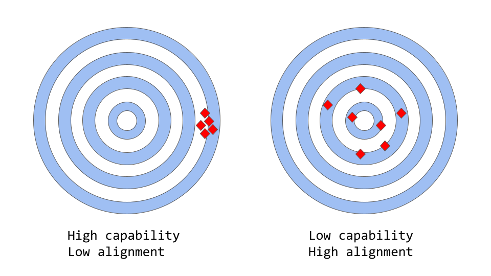
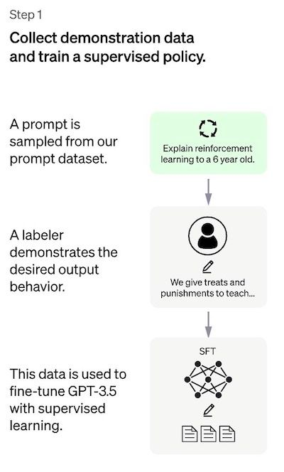
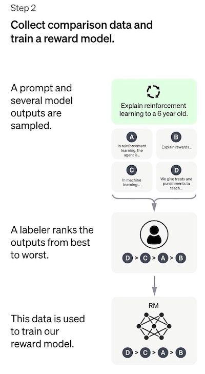
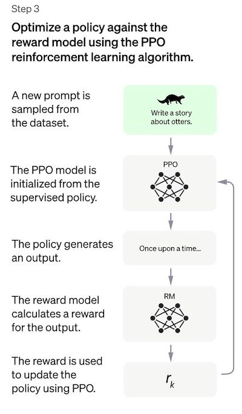

ChatGPT là một Large Language Model (LLM) mới nhất của OpenAI và cho thấy được sự cải thiện đáng kể với mô hình tiền 
nhiệm của nó GPT-3. Tương tự như nhiều LLMs, ChatGPT có khả năng sinh văn bản (text) theo nhiều phong cách khác nhau và 
cho nhiều mục đích khác nhau, nhưng ChatGPT cho thấy được khả năng về độ chính xác, chi tiết và mạch lạc hơn rất đáng kể. 
ChatGPT đang là xu hướng, nó như đại diện cho thế hệ tiếp theo của LLMs, tập trung mạnh vào sự tương tác trong hội thoại 
(interative conversations).

OpenAI họ đã sử dụng kết hợp cả Supervised Learning (học giám sát) và Reinforment Learning (học tăng cường) để tinh 
chỉnh (fine-tune) ChatGPT, **nhưng Reinforcement Learning mới là thành phần làm cho ChatGPT trở nên độc đáo hơn tất cả**. 
Kỹ thuật cụ thể được gọi là **Reinforcement Learning from Human Feedback (RLHF)**, tức là học tăng cường từ những dữ liệu 
feedback của con người, sử dụng vòng lặp feedback của con người trong quá trình huấn luyện để giảm thiểu việc đưa ra các phản hồi 
có hại, không trung thực hay là sai lệch tri thức.


### Capability vs Alignment trong LLMs

<div align="center">
    
</div>

Đầu tiền chúng ta cần hiểu 2 khái niệm *Capability* và *Alignment* trong machine learning. Khái niệm *Capability* đề cập 
tới khả năng của một model để thực hiện một hoặc nhiều task cụ thể. Khả năng của một model cụ thể được đánh giá bởi khả 
năng tối ưu objective-function (hàm tối ưu/ hàm mục tiêu) của nó tốt như thế nào? Ví dụ như, một model được thiết kế để 
dự đoán giá của thị trường  chứng khoán phải có một hàm mục tiêu nào đó đo được độ chính xác các dự đoán của model. Nếu 
model có khả năng dự đoán chính xác sự biến động giá chứng khoán theo thời gian, thì được xem là có khả năng *capability* 
cao cho task này.

Mặt khác, *Alignment* liên quan tới **những gì mà chúng ta thực sự muốn model làm** so với **những gì mà model đang được 
huấn luyện để làm**. Chúng ta sẽ đặt câu hỏi là "các hàm mục tiêu mà model sử dụng để huấn luyện có phù hợp với 
ý định của chúng ta không?" và mức độ mà các hàm mục tiêu đó và hành vi model đưa ra so với kỳ vọng của con người là như 
thế nào? Một ví dụ cụ thể đơn giản là chúng ta ây dựng một model phân loại chim để phân loại một con chim liệu nó là 
chim sẻ hay chim họa mi. Thông thường, chúng ta sử dụng log loss là hàm mục tiêu (để đo được sự phân biệt giữa phân bố xác 
suất dự đoán của mô hình và phân bố của nhãn thực) mặc dù mục tiêu cuối cùng là độ chính xác phân loại cao (accuracy). 
Vì thế, model sẽ có xu hướng low log loss, tức là *capability* của model là cao, nhưng accuracy kém trên tập test. Trong 
thực tế, log loss không hoàn toàn tương quan tới độ accuracy trong các task phân loại. Đây là một ví dụ sai lệch 
(misalignment) giữa hàm mục tiêu được tối ưu trong quá trình huấn luyện nhưng lại căn chỉnh kém mục tiêu cuối cùng.

<div align="center">
    <b><i>LLMs như GPT-3 là dạng misaligned</i></b>
</div>


Các LLMs chẳng hạn như GPT3, LLaMA, BLOOM, PaLM, ... được huấn luyện trên một lượng rất lớn dữ liệu text từ internet và 
có khả năng sinh văn bản giống như con người, nhưng không phải lúc nào LLMs cũng sinh ra được đầu ra như kỳ vọng của con 
người hoặc có tính chính xác. Trong thực tế, hàm mục tiêu của chúng là phân phối xác suất trên các chuỗi từ (word sequences)
hoặc trên chuỗi token (token sequences) mà cho phép dự đoán chính xác từ tiếp theo trong chuỗi.

Tuy nhiên, trong các ứng dụng thực tế, các model này nhằm để thực hiện một số dạng kiểu nhận dạng có giá trị, và có sự 
khác biệt rõ ràng giữa cách huấn luyện với cách mà chúng ta muốn sử dụng model. Mặc dù về mặt toán học, việc sử dụng 
phân bố thống kê chuỗi các từ có thể là một lựa chọn rất hiệu quả cho language model, nhưng con người chúng ta tạo ra 
ngôn ngữ bằng cách lựa chọn chuỗi text phù hợp nhất với tình huống nhất định bằng cách sử dụng nền tảng tri thức và 
quy tắc hay phép tắc thông thường để hướng dẫn quá trình này. Đây có thể là vấn đề khi language models được sử dụng 
trong các ứng dụng mà đòi hỏi mức độ tin cậy và độ tin tưởng cao chẳng hạn như hệ thống hội thoại (dialog systems) hoặc 
trợ lý ảo cá nhân thông minh (intelligent personal assistants).

Mặc dù những model phức tạp này được huấn luyện trên lượng dữ liệu khổng lồ đã trở nên cực kỳ hiệu quả trong vài năm 
gần đây, nhưng khi được sử dụng trong các hệ thống sản phẩm thực tế mà giúp cuộc sống con người trở nên dễ dàng hơn thì 
chúng thường không đạt được khả năng này. Một số vấn đề *alignment* trong LLMs thường thấy rõ ở dạng:

- Thiếu hữu ích: tức là mô hình không tuân theo hướng dẫn cụ thể của người dùng.
- Phi thực tế: model tạo ra những sự thật không tồn tại hoặc sai sự thật.
- Thiếu khả năng diễn giải: con người khó hiểu cách mà model đưa ra một quyết định hoặc dự đoán cụ thể.
- Bias hoặc toxic trong output: một model dược huấn luyện với dữ liệu bị bias/ toxic có thể tái tạo điều đó trong đầu ra.

Nhưng vấn đề *alignment* này bắt nguồn từ đâu? Có phải ngay từ cách mà language models được huấn luyện vốn dễ bị 
*misalignment*?

### Tại sao các phương pháp huấn luyện language model bắt gặp vấn đề *misalignment*

`Next token prediction` và `masked language modeling` là một trong số các kỹ thuật cốt lõi được sử dụng để huấn luyện 
language models, chẳng hạn như `transformers`. 

Trong cách tiếp cận đầu tiên, model có đầu vào là chuỗi các từ (hoặc  token) và dự đoán từ tiếp theo trong chuỗi. Ví dụ, 
chuỗi đầu vào của model là: `Con mèo đang nằm trên _`. Model phải dự đoán từ tiếp theo là "giường", "ghế", "bàn", "sân" 
chẳng hạn. Bởi vì xác suất xuất hiện từ tiếp theo của các từ đó trong ngữ cảnh phía trước cao. Trên thực tế, language 
model có thể ước tính khả năng xuất hiện của mỗi từ (trong vốn từ vựng của nó) có thể xuất hiện tiếp theo dựa trên chuỗi 
từ trước đó. 

Cách tiếp cận theo `masked language modeling` là một biến thể của `next token prediction`, trong đó một số từ trong 
chuỗi đầu vào được thay thế bởi một token đặc biệt, ví dụ như [MASK]. Model có nhiệm vụ dự đoán chính xác từ sẽ được 
thêm vào vị trí được mask. Ví dụ, chuỗi đầu vào của model là: `Con [MASK] đang nằm trên ghế .` thì model phải dự đoán 
được từ được mask là "mèo", "chó", hoặc "thỏ" chẳng hạn.

Một trong những ưu điểm của các hàm mục tiêu này là cho phép model học cấu trúc dựa theo thống kê của ngôn ngữ, chẳng 
hạn như chuỗi các từ phổ biến hay là các mẫu (patterns) sử dụng từ nào đó. Điều này thường giúp cho model sinh ra văn 
bản trôi chảy và tự nhiên hơn, đồng thời đó cũng là một bước pre-training của mọi language model.

Tuy nhiên, các hàm mục tiêu này cũng có thể dẫn tới các vấn đề, về cơ bản là do model không có khả năng phân biệt giữa 
những lỗi quan trọng và không quan trọng. Một ví dụ đơn giản, giả sử model được cho trước một câu (sentence) sau: 
`Đề chế La Mã [MASK] với triều đại Augustus.`. Model có thể dự đoán là "bắt_đầu" hoặc "kết_thúc" vì cả hai đều có khả 
năng xảy ra rất cao (thực sự thì cả 2 câu đều đúng về mặt lịch sử), mặc dù lựa chọn thứ 2 mang 1 ý nghĩa rất khác.

Tổng quát hơn, các chiến lược huấn luyện này có thể dẫn tới vấn đề *misalignment* trong language model đối với nhiều 
task phức tạp, bởi vì một model chỉ được huấn luyện với việc dự đoán từ tiếp theo (hoặc mask token) trong chuỗi text, 
có thể nó không cần học được các biểu diễn high-level hơn về ý nghĩa của nó cũng đã đáp ứng đủ tốt với hàm mục tiêu đó. 
Kết qủa là model gặp khó khắn lớn trong việc khái quát hóa được các task hoặc context mà yêu cầu hiểu sâu hơn về ngôn 
ngữ.

Các nhà nghiên cứu hay các nhà phát triển họ đang nghiên cứu các hướng khác nhau để giải quyết vấn đề *alignment* trong 
LLMs. ChatGPT dựa trên GPT-3 là 1 LLMs nhưng đã được huấn luyện thêm bằng cách sử dụng feedbach của con người để làm cho 
quá trình learning của model với mục địch cụ thể là giảm thiểu được các vấn đề về *misalignment*. Cụ thuật cụ thể đó 
được gọi là **Reinforcement learning from Human Feedback**. ChatGPT là trường hợp đầu tiên sử dụng kỹ thuật này cho model 
được đưa vào sản phẩm. 

Nhưng cách mà những người đã tạo ra ChatGPT họ đã sử dụng feecback của con người để giải quyết vấn đề *alignment* như 
thế nào cũng là một câu hỏi rất cần được giải đáp.

### Reinforcement Learning from Human Feedback (RLHF)

Phương pháp này gồm 3 bước như sau:

1. **Supervised fine-tuning:** Pre-trained LLMs được fine-tune trên một lượng nhỏ dữ liệu người ta gọi là *demonstration 
data* được tạo ra bởi những người gán nhãn (labelers) để learn được supervised policy (**SFT model**) và sinh output 
từ các prompt đã được chuẩn bị. Để hiểu hơn về *demonstration data* bạn có thể xem giải thích của mình ở phần chi tiết 
các bước hình thành chatGPT bên dưới. Nói tóm lại, quá trình này tạo ra chúng ta cho ra được 1 model baseline.

2. **Mimic human preference:**  Bước này sẽ có một bộ dữ liệu mới được tạo ra bởi những người gán nhãn bằng cách họ sẽ 
voting các text được sinh bởi SFT model, bộ dữ liệu này được gọi là *comparision data*. **Reward model (RM)** sẽ được huấn 
luyện trên chính bộ dữ liệu này.

3. **Proximal Policy Optimization (PPO):** Reward model được sử dụng để fine-tune và cải thiện SFT model. Output của bước 
này hay được gọi là **Policy model**, về cơ bản nó cũng chính là SFT model sau khi được fine-tuned.

Ở bước 1 chỉ thực hiện một lần duy nhất, còn bước 2 và 3 có thể được lặp đi lặp lại liên tục bởi vì khi càng nhiều 
comparision data thu được dựa trên best policy cho tới thời điểm đó sẽ được huấn luyện để tạo ra một reward model và 
policy model mới tốt hơn.

#### Bước 1: Supervised Fine-Tuning (SFT) model

Bước đầu tiên bao gồm việc thu thập/ xây dựng bộ dữ liệu được gọi là *demonstration data* để huấn luyện supervised policy 
model. *Demonstration data* tức là bộ dữ liệu mà được sử dụng để minh hoạ hoặc giới thiệu cách mà model hoạt đông, giúp 
model học được các mẫu và cấu trúc ngôn ngữ, hiểu ngôn ngữ một cách chính xác hơn, học được các dạng task mà model sẽ 
dần hình thành trong bước này. Ví dụ như nó giúp model nhận dạng được cách xử lý với task phân loại, trích xuất, QnA, 
generation, ... chảng hạn. Trong quá trình này người ta sẽ chuẩn bị bộ dữ liệu này đa dạng task nhất có thể. Tất nhiên, 
việc đa dạng, xây dựng bộ dữ liệu này tốt cũng sẽ giúp model learn tốt hơn, hiểu và đưa ra phản hồi chính xác hơn.

- Thu thập dữ liệu: Một list các prompt được thu thập, lựa chọn và một nhóm người gán nhãn họ sẽ được yêu cầu để viết ra 
phản hồi đầu ra kỳ vọng cho prompt đó. Đối với chatGPT, 2 nguồn prompt khác nhau được sử dụng là: một số được chuẩn bị 
trực tiếp bởi những người gán nhãn của họ và các developers, một số được lấy từ requests của OpenAI public ra cộng đồng 
và thu được từ người dùng. Vì quá trình này chậm và đắt đỏ, chính vì thế kết quả họ chỉ thu được một lượng dữ liệu tương 
đối nhỏ, chất lượng tốt (~ 12-15k data points) được sử dụng để fine-tune LLM. 

- Lựa chọn model: Nhà phát triển chatGPT sử dụng pre-trained LLM để fine-tune là `GPT-3` hoặc các biến thể của nó như là 
`GPT-3.5`, `text-davinci-003`.

<div align="center">
    
</div>

Bởi vì giới hạn số lượng dữ liệu cho bước này, SFT model sau quá trình này có khả năng sinh ra text nhưng vẫn gặp vấn 
zđề *misalignment*. Vấn đề ở bước supervised learning là yêu cầu chi phí để mở rộng bộ dữ liệu cao. Để giải quyết vấn đề 
này, thay vì yêu cầu những người gán nhãn họ phải tạo ra bộ dữ liệu supervised lớn, tốn nhiều thời gian và chi phí, thì 
chiến lược bây giờ là để những người gán nhãn họ ranking các output khác nhau (candidates) của SFT model để tạo ra một 
Reward model.

#### Bước 2: Reward Model (RM)

Mục tiêu là để learn được hàm mục tiêu (reward model) trực tiếp từ dữ liệu. Mục đích của hàm này là đưa ra 1 score thể 
hiện mức độ đánh những outputs của SFT model so với mong muốn của con người. Thực tế điều này sẽ phản ảnh được sở thích 
cụ thể của một nhóm người gán nhãn dữ liệu và hướng dẫn/ quy tắc ranking chung mà hỗ đã cùng follow. Cuối cùng, quá trình 
này sẽ trích xuất từ dữ liệu một hệ thống tự động bắt bước hành vi giống như con người. 

Cách nó hoạt động như sau:

- Một list các prompts được lựa chọn và SFT model sinh ra nhiều outputs (candidates), thường là từ 4 -> 9 cho mỗi prompt.
- Những người gán nhãn họ sẽ ranking các outputs từ score cao tới thấp. Score càng cao thì sẽ càng giống với kỳ vọng của 
con người. Kết quả sẽ thu được một bộ dữ liệu mới, trong đó thứ tự ranking là nhãn. Kích thước của bộ dữ liệu này có thể 
gấp khoảng 10 lần so với dữ liệu ở bước 1 được huấn luyện cho SFT model.
- Bộ dữ liệu mới này được sử dụng để huấn luyện reward model (RM). Model này lấy đầu vào là các outputs của SFT model và 
ranks chúng theo thứ tự kỳ vọng của con người.

<div align="center">
    
</div>

Đối với những người gán nhãn, việc rank các outputs này dễ dàng hơn nhiều so với việc tạo dữ liệu supervised từ đầu như 
ở bước 1. Quá trình này scale-up dễ dàng và hiệu quả hơn. Thực tế, bộ dữ liệu này được tạo từ việc lựa chọn khoảng 30-40k 
prompts, và số lượng khác nhau của outputs SFT model giữa các prompt.

#### Bước 3: Fine-tuning SFT model thông qua Proximal Policy Optimization (PPO)

Reinforcement Learning ở bước này được sử dụng để fine-tune SFT policy bằng việc tối ưu nó bởi reward model. Thuật toán 
được sử dụng cho quá trình này là Proximal Policy Optimization (PPO) và model sau khi được fine-tuned được gọi là PPO 
model.

Một câu hỏi đặt ra PPO là gì?

Mình sẽ note những điểm chính của phương pháp này.

- PPO là một thuật toán được sử dụng để huấn luyện các agents trong reinforcement learning. Nó được gọi là thuật toán 
"on-policy" bởi vì học và cập nhật một cách trực tiếp policy hiện tại, thay vì học từ các kinh nghiệm trong quá khứ như 
trong các thuật toán "off-policy" chẳng hạn như DQN (Deep Q-Network). Điều đó có nghĩa là PPO luôn liên tục điều chỉnh 
policy hiện tại dựa trên các action mà agent đang thực thi và reward mà nó nhận được. 
- PPO sử dụng phương pháp [trust region optimization](https://en.wikipedia.org/wiki/Trust_region?ref=assemblyai.com) để 
huấn luyện policy, có nghĩa là nó hạn chế thay đổi trong policy mới trong một khoảng nhất định so với policy trước đó 
nhằm mục đích để đảm bảo tính ổn định (stability). Điều này trái ngược với các phương pháp policy gradient khác có thể 
cập nhật thay đổi lớn cho policy có thể gây ra vấn đề không stable trong quá trình learning.
- PPO sử dụng một hàm giá trị (value function) để ước tính giá trị trả về (value return) của một state hoặc action 
nhất định. Value function được sử dụng để tính toán advantage function biểu diễn sự khác nhau giữa expected return và 
current return. Sau đó advantage function được sử dụng để cập nhật policy bằng cách so sánh action thực hiện bởi policy 
hiện tại và action sẽ được thực hiện bởi policy trước đó. Điều này cho phép PPO thực hiện các cập nhật sáng suốt hơn cho 
policy dựa trên giá trị được ước tính của các action được thực hiện.

```angular2html
Phương pháp trust region optimization -phương pháp tối ưu hóa khu vực tin cậy là một phương pháp tối ưu hóa trong đó 
ta giải quyết vấn đề tối ưu hóa bằng cách tìm kiếm một điểm tối ưu trong một vùng "trust region - vùng tin cậy" của 
không gian tìm kiếm. Điều này được thực hiện bằng cách giới hạn các bước cập nhật giá trị biến của bài toán tối ưu 
trong một vùng khu vực nhỏ xung quanh điểm hiện tại, gọi là "trust region". Vùng tin cậy này được xác định bằng cách 
sử dụng một hàm mô hình bậc hai (quadratic model) để dự đoán sự thay đổi của hàm mục tiêu trong vùng đó.
```

Trong bước này, PPO model được khởi tạo từ chính SFT model, tức nó ban đầu chính là SFT model. Value function được khởi 
tạo từ reward model. Môi trường là bandit enviroment biểu diễn một prompt ngẫu nhiên và response tương ứng cho prompt đó. 
Từ prompt và response có thể đưa một reward (được xác định bởi reward model).

<div align="center">
    
</div>


### Performance Evaluation 

Bởi vì model được huấn luyện trên dữ liệu đầu vào của những người gán nhãn, chính vì thành phần cốt lõi của việc đánh 
giá cũng dựa trên đầu vào của con người, tức là để con người đánh giá chất lượng outputs của model. Để tránh việc 
overfiting với mindset của những người đã gán nhãn trong quá trình huấn luyện, quá trình test sử dụng prompts từ 
cộng đồng của OpenAI mà không được dùng trong quá trình huấn luyện. 

Model được đánh giá dựa trên 3 tiêu chí high-level:

- Tính hữu ích: đánh giá khả năng của model follow theo hướng dẫn (instruction) của con người, cũng như suy luận.
- Tính đúng đắn, chân thực: đánh giá mức độ ảo của model, tức là tạo ra lời bịa đặt trên closed-domain tasks. Model có 
thể được đánh giá trên bộ dữ liệu TruthfulQA.
- Tính vô hại: đánh giá liệu output của model liệu có phù hợp hay không, sinh ra output làm tổn hại các lớp đối tượng 
được bảo vệ hay là chứa các nội dung xúc phạm hay không. Model có thể được benchmark trên bộ dữ liệu như RealToxicityPrompts, 
CrowS-Pairs.

Model cũng được đánh giá khả năng zero-shot trên các task NLP truyền thống như QA, MRC, Summarization. 


### References

[1] Training language models to follow instructions with human feedback, [https://arxiv.org/pdf/1706.03741.pdf](https://arxiv.org/pdf/1706.03741.pdf).

[2] Training a Helpful and Harmless Assistant with Reinforcement Learning from Human Feedback, [https://arxiv.org/pdf/2204.05862.pdf](https://arxiv.org/pdf/2204.05862.pdf).

[3] Learning to summarize from human feedback, [https://arxiv.org/pdf/2009.01325.pdf](https://arxiv.org/pdf/2009.01325.pdf).

[4] Proximal Policy Optimization Algorithms, [https://arxiv.org/pdf/1707.06347.pdf](https://arxiv.org/pdf/1707.06347.pdf).

[5] Deep reinforcement learning from human preferences, [https://arxiv.org/pdf/1706.03741.pdf](https://arxiv.org/pdf/1706.03741.pdf).

[6] A General Language Assistant as a Laboratory for Alignment, [https://arxiv.org/pdf/2112.00861.pdf](https://arxiv.org/pdf/2112.00861.pdf).