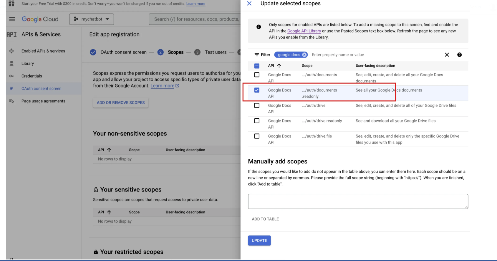
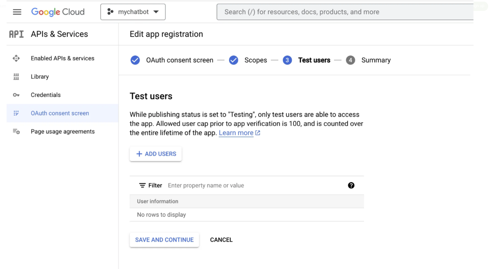
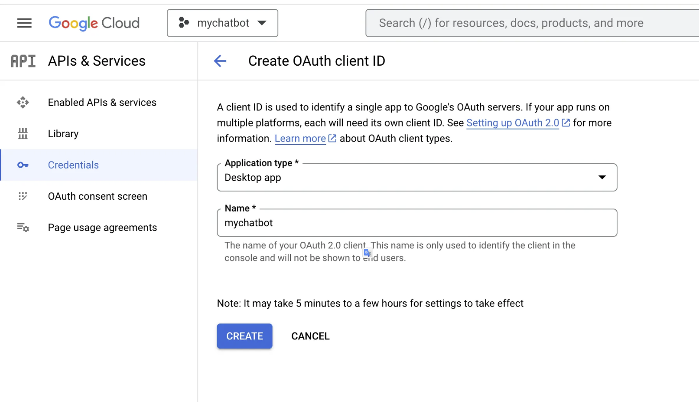
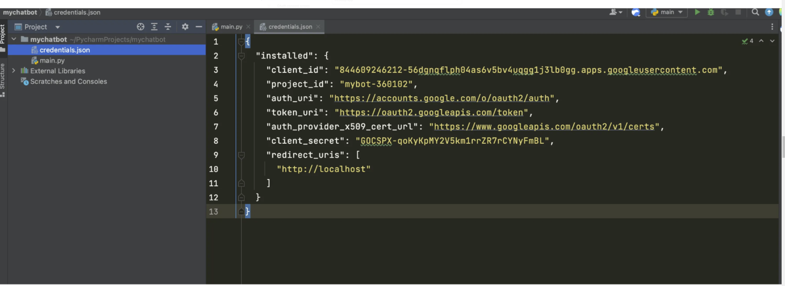
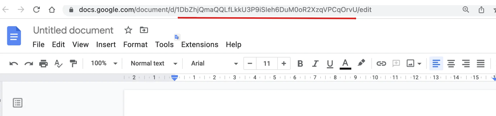
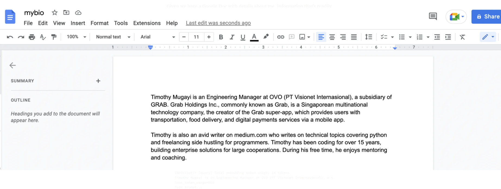
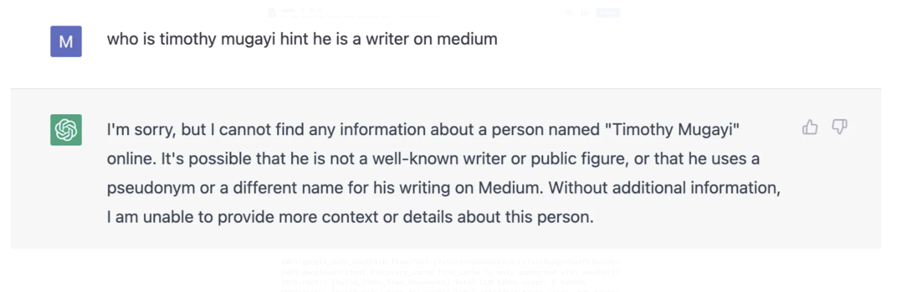

Hướng dẫn custom mô hình ChatGPT với dữ liệu tùy chỉnh của mình (Custom Knowledge Base)


Hiện nay, ChatGPT là "người bạn quốc dân", trở thành một công cụ không thể thiếu mà hầu hết mọi người sử dụng hàng ngày để tự động hóa các tác vụ (tasks) khác nhau. Nếu bạn đã sử dụng ChatGPT một thời gian, bạn sẽ dễ dàng nhận ra nó có thể đưa ra các câu trả lời sai và có hạn chế hoặc không có context trong một số topic đặc thù nào đó. Điều này đặt ra câu hỏi về cách chúng ta có thể tận dụng ChatGPT để thu hẹp khoảng cách và cho phép ChatGPT có cơ chế để sử dụng Custom data để đưa câu trả lời chính xác hơn.

Rất nhiều tri thức (knowledge) mà chúng ta đưa lên các nền tảng khác nhau mà chúng ta tương tác hàng ngày, ví dụ như Confluence wiki pages hay sử dụng trong công việc, slack group, company knowledge base, Reddit, Stack Overflow, Google documents, ... Trong thực tế thì bản thân việc cập nhật các tài liệu này cũng là một công việc tốn khá nhiều thời gian.

Thế làm thể nào để chúng ta có thể chọn lọc nguồn dữ liệu của mình một cách có chọn lọc và cung cấp thông tin đó vào cuộc trò chuyện ChatGPT với dữ liệu của chúng ta một cách dễ dàng?

1. Cung cấp dữ liệu thông qua kỹ thuật Prompting


Chắc hẳn dạo này ngành nghề này đang hot. Bỏ qua lý do tại sao nó nổi lên, chúng ta ta có thể nói đây là cách mở rộng ChatGPT một cách thủ công. Cách tiếp cận thông thường trong việc extend ChatGPT là thông qua kỹ thuật prompting và vấn đề của nó là gì? 

Điều này khá đơn giản để thực hiện vì ChatGPT có hiểu nhận biết context tốt. Chúng ta tương tác với ChatGPT bằng cách nối thêm nội dung document vào các câu hỏi thực tế.

```js
Tôi sẽ đặt câu hỏi cho bạn dựa trên Content sau:
- Start of Content-
Your very long text to give ChatGPT context
- End of Content-
```

Vấn đề với cách tiếp cận này là mô hình có giới hạn context, nó chỉ có thể chấp nhận khoảng 4,097 tokens cho `GPT-3`. Chúng ta sẽ sớm gặp khó khăn với cách tiếp cận này khi tới 1 ngưỡng giới hạn vì đây cũng là một quy trình khá thủ công, tẻ nhạt khi luôn phải nối vào content. Giả dụ như chúng ta có hàng trăm tài liệu PDF mà muốn đưa vào ChatGPT, chúng ta sẽ gặp phải vấn đề nêu trên. Chúng ta có thể nghĩ tới sử dụng `GPT-4` là phiên bản kế thừa của `GPT-3` được ra mắt vào 14/3/2023 và có thể xử lý được 25,000 wtokensords - gấp khoảng 8 lần so với `GPT-3.5`. Điều này cũng có cùng 1 vấn đề cơ bản về giới hạn đầu vào. Làm thế nào để giải quyết một số hạn chế này?

-> Chúng ta có thể tận dụng một thư viện Python đó là `LLamaIndex`.


2. Extend ChatGPT sử dụng `LLamaIndex`

`LLamaIndex` còn được gọi là GPT Index, là một thư viện cung cấp interface để connect giữa LLMs với external data. `LLamaIndex` kết nối nguồn dữ liệu của chúng ta với nhiều loại (types) với data connectors, ví dụ các loại data sources như APIs, PDFs, Docs, etc. Bạn có thể xem kỹ hơn [ở đây](https://llamahub.ai/). Nó cho phép chúng ta sử dụng LLMs bằng cách cung cấp các indexes trên các dữ liệu có cấu trúc (structed data) và dữ liệu phi cấu trúc (unstructed data).

Giải quyết các vấn đề hạn chể của prompting khi context quá lớn đã trở nên dễ dàng hơn nhiều và giải quyết được vấn đề việc phải split text bằng cách cung cấp tương tác qua index. `LLamaIndex` cũng tóm tắt quá trình trích xuât các phần có liên quan từ documents và đưa chúng vào prompt.

### Làm sao để thêm Custom data source?

Chúng ta có thể sử dụng GPT `text-davinci-03` và `LLamaIndex` để tạo 1 Q&A chatbot dựa trên các documents có sẵn của chúng ta. 

Trước khi bắt đầu, chúng ta cần phải set-up:

- Python >= 3.7
- Có OpenAPI key, có thể tìm thấy ở [OpenAI website](https://platform.openai.com/account/api-keys). 
- Một số documents được upload lên Google Docs. `LLamaIndex` hỗ trợ nhiều kiểu data source khác nhau. Trong ví dụ minh họa này, mình sẽ thử với Google Docs.

<div align="center">
    
</div>


### Cách hoạt động

1. Tạo index dữ liệu document với `LLamaIndex`.
2. Sử dụng câu query để search index.
3. Các phần phù hợp sẽ được retrieved bởi `LLamaIndex` và được đưa vào prompt. `LLamaIndex` sẽ biến đổi dữ liệu document gốc của chúng ta thành index vector hóa dễ. Nó sẽ sử dụng index này để tìm kiếm các phần (section) liên quan nhất dựa trên mức độ matching giữa query và data. Thông tin này sau đó được đưa vào prompt, và prompt sẽ được GPT để GPT có context cần thiết để trả lời câu hỏi.
4. Sau đó, chúng ta có thể hỏi ChatGPT đã được cung cấp context.

### Cùng thử nghiệm

Đầu tiên, chúng ta cần tạo 1 folder project Python, cài dặt các môi trường có thể sử dụng Conda.

Chúng ta cần cài đặt các thư viện phụ thuộc như sau:

```js
pip install openai
pip install llama-index
pip install google-auth-oauthlib
```

Tiếp theo, chúng ta sẽ import các thư viện bằng Python và thiết lập OpenAI key trong file `main.py`.

```py
# Import necessary packages
import os
import pickle

from google.auth.transport.requests import Request

from google_auth_oauthlib.flow import InstalledAppFlow
from llama_index import GPTSimpleVectorIndex, download_loader
```

```py
os.environ['OPENAI_API_KEY'] = 'SET-YOUR-OPEN-AI-API-KEY'
```

Trong snippet trên thì chúng ta thiết lập biến môi trường một cách rõ ràng, vì gói `LLamaIndex` yêu cầu truy cập vào OpenAI một cách ngầm định.

Triển khai function để xác thực tài khoản Google để sử dụng Google Docs

```py
def authorize_gdocs():
    google_oauth2_scopes = [
        "https://www.googleapis.com/auth/documents.readonly"
    ]
    cred = None
    if os.path.exists("token.pickle"):
        with open("token.pickle", 'rb') as token:
            cred = pickle.load(token)
    if not cred or not cred.valid:
        if cred and cred.expired and cred.refresh_token:
            cred.refresh(Request())
        else:
            flow = InstalledAppFlow.from_client_secrets_file("credentials.json", google_oauth2_scopes)
            cred = flow.run_local_server(port=0)
        with open("token.pickle", 'wb') as token:
            pickle.dump(cred, token)
```

Để kích hoạt Google Docs API và lấy thông tin xác thực trên Google Console, chúng ta có thể làm theo các bước sau:

1. Truy cập trang web Google Cloud Console (console.cloud.google.com).
2. Tạo một dự án mới nếu chưa có. Có thể làm điều này bằng cách nhấp vào menu thả xuống "Select a project" trên thanh điều hướng đầu trang và chọn "New project". Làm theo các hướng dẫn để đặt tên cho dự án và chọn tổ chức mà muốn liên kết với nó.
3. Khi dự án được tạo, hãy chọn nó từ menu thả xuống trên thanh điều hướng đầu trang.
4. Truy cập phần "APIs & Services" từ menu bên trái và nhấp vào nút "+ ENABLE APIS AND SERVICES" ở đầu trang.
5. Tìm kiếm "Google Docs API" trong thanh tìm kiếm và chọn nó từ danh sách kết quả.
6. Nhấp vào nút "Enable" để kích hoạt API cho dự án.
7. Nhấp vào menu OAuth consent screen và tạo và đặt tên cho ứng dụng, ví dụ như "mychatbot", sau đó nhập địa chỉ email hỗ trợ, lưu và thêm các phạm vi.

<div align="center">
    
</div>

Bạn cũng phải thêm người dùng thử nghiệm vì ứng dụng Google này sẽ chưa được phê duyệt. Đây có thể là email của riêng bạn.

<div align="center">
    
</div>

Sau đó, chúng ta sẽ cần thiết lập thông tin đăng nhập cho dự án của mình để sử dụng API. Để thực hiện việc này, hãy chuyển đến phần "Credentials" từ menu bên trái và nhấp vào "Create Credentials". Chọn "OAuth client ID" và làm theo lời nhắc để thiết lập thông tin đăng nhập của bạn.

<div align="center">
    
</div>

Khi thông tin đăng nhập của chúng tabạn được thiết lập, chúng ta có thể tải xuống tệp JSON và lưu trữ tệp đó trong thư mục gốc của ứng dụng, như minh họa bên dưới:

<div align="center">
    
</div>

Khi chúng ta đã thiết lập thông tin đăng nhập của mình, chúng ta có thể truy cập API Google Docs từ project Python của mình.

Truy cập Google Docs, mở một vài trong số chúng và nhận id duy nhất có thể nhìn thấy trong thanh URL trình duyệt của bạn, như minh họa bên dưới:

<div align="center">
    
</div>

Sao chép ID gdoc và dán chúng vào code bên dưới. Có thể có N gdocs mà chúng ta có thể index để ChatGPT có quyền truy cập theo context vào custom knowledge base này. Chúng ta sẽ sử dụng plugin GoogleDocsReader từ thư viện `LLamaIndex` để tải tài liệu.

```py
# function to authorize or download latest credentials 
authorize_gdocs()

# initialize `LLamaIndex` google doc reader 
GoogleDocsReader = download_loader('GoogleDocsReader')

# list of google docs we want to index 
gdoc_ids = ['1ofZ96nWEZYCJsteRfqik_xNQTGFHtnc-7cYrf0dMPKQ']

loader = GoogleDocsReader()

# load gdocs and index them 
documents = loader.load_data(document_ids=gdoc_ids)
index = GPTSimpleVectorIndex(documents)
```

Nếu chúng ta muốn lưu và tải index một cách nhanh chóng, chúng ta có thể sử dụng function sau. Điều này sẽ tăng tốc quá trình fetching từ các indexes được lưu trước thay vì thực hiện lệnh gọi API tới  external sources.

```py
# Save your index to a index.json file
index.save_to_disk('index.json')
# Load the index from your saved index.json file
index = GPTSimpleVectorIndex.load_from_disk('index.json')
```

Query index và nhận được phản hồi có thể đạt được bằng cách chạy code bên dưới. Code có thể dễ dàng được mở rộng thành restAPI kết nối với UI mọi người có thể tương tác với các nguồn dữ liệu tùy chỉnh của mình thông qua interface của GPT.

```py
# Querying the index
while True:
    prompt = input("Type prompt...")
    response = index.query(prompt)
    print(response)
```

Chúng ta có Google Docs với thông tin chi tiết về Timothy Mugayi.

<div align="center">
    
</div>

Trước tiên, chúng ta sẽ thử tương tác trực tiếp với vanilla ChatGPT để xem đầu ra mà nó tạo ra mà không cần đưa vào custom data source.

<div align="center">
    
</div>


Hơi thất vọng =)))

Thử lại với ChatGPT với việc đưa vào Custom data source.

```js
INFO:google_auth_oauthlib.flow:"GET /?state=oz9XY8CE3LaLLsTxIz4sDgrHha4fEJ&code=4/0AWtgzh4LlIfmCMEa0t36dse_xoS0fXFeEWKHFiouzTvz4Qwr7T2Pj6anb-GiZ__Wg-hBBg&scope=https://www.googleapis.com/auth/documents.readonly HTTP/1.1" 200 65
INFO:googleapiclient.discovery_cache:file_cache is only supported with oauth2client<4.0.0
INFO:root:> [build_index_from_documents] Total LLM token usage: 0 tokens
INFO:root:> [build_index_from_documents] Total embedding token usage: 175 tokens
Type prompt...who is timothy mugayi hint he is a writer on medium

INFO:root:> [query] Total LLM token usage: 300 tokens
INFO:root:> [query] Total embedding token usage: 14 tokens
Timothy Mugayi is an Engineering Manager at OVO (PT Visionet Internasional), a subsidiary of GRAB. He is also an avid writer on medium.com who writes on technical topics covering python and freelancing side hustling for programmers. Timothy has been coding for over 15 years, building enterprise solutions for large cooperations. During his free time, he enjoys mentoring and coaching.
last_token_usage=300
Type prompt...

Type prompt...Given you know who timothy mugayi is write an interesting introduction about him

Timothy Mugayi is an experienced and accomplished professional with a wealth of knowledge in engineering, coding, and mentoring. He is currently an Engineering Manager at OVO, a subsidiary of GRAB, and has been coding for over 15 years, building enterprise solutions for large cooperations. In his free time, Timothy enjoys writing on technical topics such as Python and freelancing side hustling for programmers on medium.com, as well as mentoring and coaching. With his impressive background and expertise, Timothy is a valuable asset to any organization.
last_token_usage=330
```

Giờ đây, nó có thể suy luận câu trả lời bằng cách sử dụng nguồn dữ liệu tùy chỉnh mới, tạo ra kết quả sau đây một cách chính xác.'

`LLamaIndex` sẽ dùng prompt của chúng ta, search index để tìm các chunks liên quan, sau đó chuyển cả prompt của chúng ta và các phần liên quan đó cho mô hình ChatGPT. Các quy trình trên cho thấy một cách cơ bản đầu tiên để sử dụng `LLamaIndex` và GPT để trả lời câu hỏi. 

Chúng ta có thể một package Python khác đi kèm với `LLamaIndex` có tên là `langchain` như sau.

```py
from langchain import OpenAI
from llama_index import LLMPredictor, GPTSimpleVectorIndex, PromptHelper

...

# define anoter LLM explicitly
llm_predictor = LLMPredictor(llm=OpenAI(temperature=0, model_name="text-davinci-003"))

# define prompt configuraiton
# set maximum input size
max_input_size = 4096
# set number of output tokens
num_output = 256
# set maximum chunk overlap
max_chunk_overlap = 20
prompt_helper = PromptHelper(max_input_size, num_output, max_chunk_overlap)

index = GPTSimpleVectorIndex(
    documents, llm_predictor=llm_predictor, prompt_helper=prompt_helper
)
```

### Kết luận

ChatGPT kết hợp với LLamaIndex có thể giúp xây dựng Custom chatbot ChatGPT có thể suy ra kiến thức dựa trên Custom data source. Trong khi ChatGPT và 
các LLM khác khá mạnh, việc mở rộng mô hình LLM cung cấp một trải nghiệm tinh vi hơn và mở ra khả năng xây dựng một chatbot kiểu đối thoại có thể được sử dụng để xây
dựng các trường hợp sử dụng kinh doanh thực tế như hỗ trợ khách hàng hoặc ngay cả bộ phân loại thư rác. Với khả năng cung cấp dữ liệu thời gian thực, chúng ta có thể 
đánh giá một số giới hạn của các mô hình ChatGPT được đào tạo trong một khoảng thời gian nhất định.